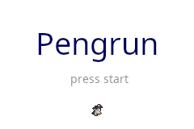

# buGgedBoy Advance

This is my attempt at building a somewhat useful C++20 library for Gameboy Advance
(Game) Development. It should be a playground for developing moderately modern bare
metal C++. The Project also includes a simple clang and make based buildsystem.
Using only the `nice` features, which add clarity and/or usability, while
not introducing unnecessary overhead or hinder (runtime) performance.

```
DISCLAIMER: The project is an early stage and EVERYTHING is subject to change
```

## Build Requirements

- clang/llvm
- arm-none-eabi-*
- [grit]() for automatic asset conversion
- emulator
    - currently only mgba supported

### Setup

Some include paths must be adjusted in `Makefile.conf`.

## Building

//TODO: extend

### Build simple LCD example
```
make example_lcd_pixel
```

### Build and run example Game

- requires grit

```
make run_pengfly
```



### Environment variables

```
RELEASE=1 for release builds
EMU=mgba-qt for qt version of mgba
USE_GCC=1 for using GCC instead of clang for compilation/assembly
TERMEMU=$something for using another terminal emulator when starting stuff like gdb
TERMEMUFL=$something change terminal emulator options (default `-e`)
```

### Debugging

#### with gdb

```
make gdb_pengfly
```

#### with mgba

```
make dbg_pengfly
```

## Running

- requires mgba

```
make run_pengfly
```

## Generating compilation database (for clangd)

```
make cdb
```

## TODO

- [ ] A lot
